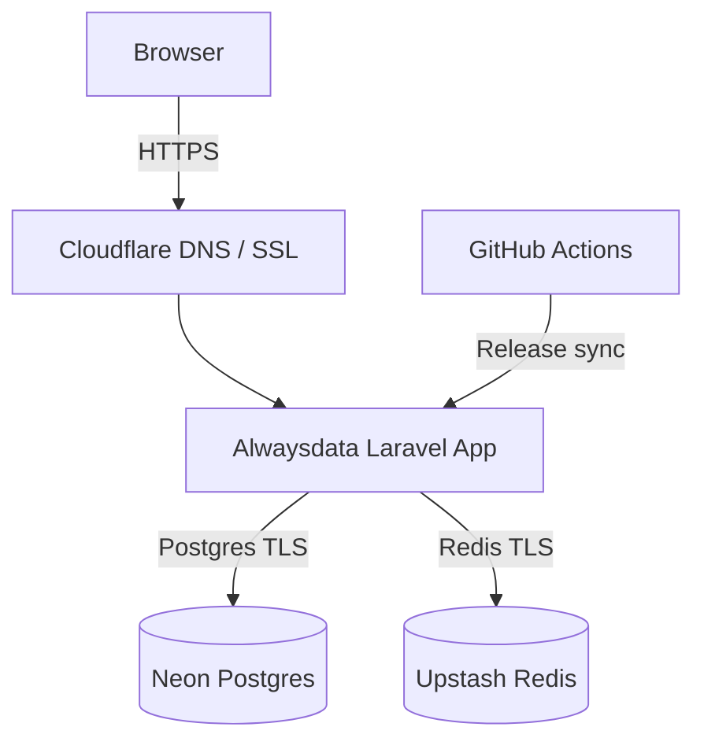
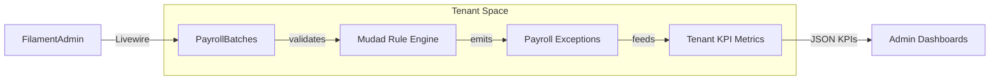
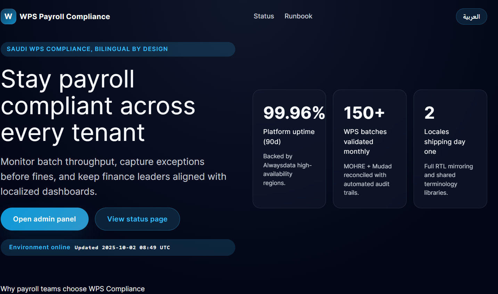
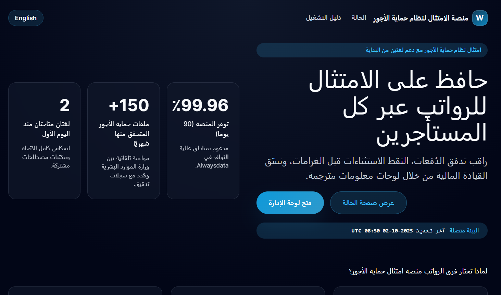
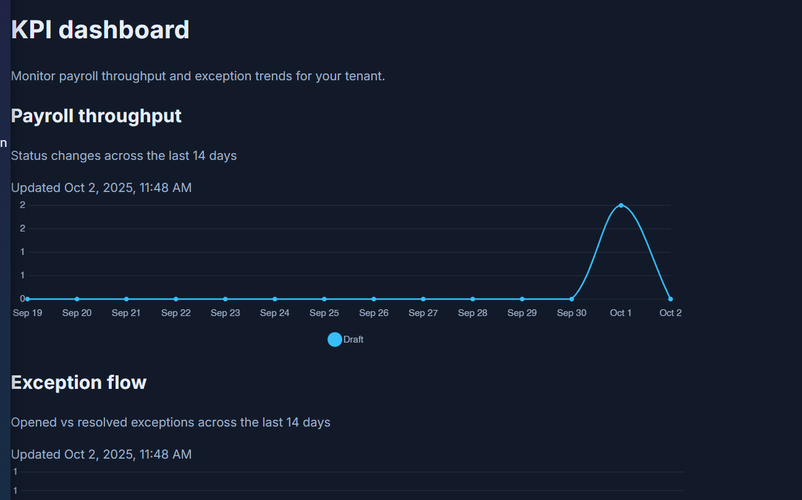

# WPS Payroll Compliance

Automate Wage Protection System (WPS) submissions, spot payroll anomalies before they reach regulators, and deliver dashboards that operations teams genuinely enjoy using. WPS Payroll Compliance keeps everything deployable on a free-tier stack while staying bilingual and multi-tenant from day one.

## Why Teams Choose It
- **Compliance without chaos** – Encode Mudad and SIF rules once, reuse them for every tenant, and prove adherence with traceable audit data.
- **Tenant isolation by default** – Stancl Tenancy segregates payroll data and KPIs so enterprise customers stay within their regulatory boundaries.
- **Bilingual UX + PWA** – Arabic and English experiences with RTL layouts, offline support, and install prompts in a single codebase.
- **Free-tier friendly** – Runs on Alwaysdata + Neon + Upstash with automated GitHub Actions deploys and zero containers to babysit.
- **Observable operations** – Filament dashboards, KPI APIs, and queue baselines keep payroll runs predictable during month-end spikes.

## Feature Highlights
- **Filament Admin Portal** – Role-aware widgets, Livewire forms, and SSO-ready guards for payroll managers.
- **Employee Import Pipeline** – Spreadsheet validation, preview, and queued ingestion with exception surfacing.
- **Exception Workspace** – Track, triage, and resolve payroll exceptions with SLA breach counters and audit trails.
- **Tenant KPIs** – `/admin/kpi/*` endpoints expose throughput and exception trends for custom dashboards.
- **Localization & PWA Shell** – Runtime locale switching, translated manifests, and service worker caching for resilience.
- **Blue/Green Deploys** – GitHub Action promotes atomic releases on Alwaysdata and prunes previous builds automatically.

## Architecture at a Glance




## Tech Stack
- ⚙️ **Backend**: PHP 8.3, Laravel 12, Stancl Tenancy, Livewire 3, Filament 3, Laravel Prompts, Laravel MCP.
- 🗄️ **Databases**: 🐘 Neon (Postgres), Upstash Redis, database-backed cache store for rate limiting.
- 🎨 **Frontend**: ⚡ Vite, 🎨 Tailwind CSS 4, ⛰️ Alpine.js via Livewire components, 📱 PWA service worker.
- 🧪 **Tooling & QA**: Pest 3, PHPUnit 11, Laravel Pint, Lighthouse CI, GitHub Actions CI/CD.
- ☁️ **Hosting & Delivery**: Alwaysdata PHP runtime, Cloudflare DNS/SSL edge, Vercel (optional docs site).

## Screenshots




## API Overview
| Method | Endpoint | Auth | Description |
| --- | --- | --- | --- |
| GET | `/health` | None | Simple uptime probe returning `{ "status": "ok" }`. |
| GET | `/admin/kpi/throughput` | Session (tenant) | Returns daily payroll batch throughput grouped by status. |
| GET | `/admin/kpi/exceptions` | Session (tenant) | Exposes opened vs resolved exceptions, status snapshot, and SLA breach count. |
| POST | `/locale/{locale}` | None | Switches user locale and stores it in the session. |
| POST | `/livewire/update` | Session | Livewire transport for Filament forms, including login and admin interactions. |

### KPI Response Sample
```json
{
  "labels": ["2025-09-21", "2025-09-22"],
  "datasets": [
    {
      "key": "completed",
      "label": "Completed",
      "data": [12, 18]
    },
    {
      "key": "processing",
      "label": "Processing",
      "data": [3, 1]
    }
  ],
  "generated_at": "2025-09-22T18:04:02+00:00"
}
```

## Getting Started
1. Clone the repository and copy `.env.example` to `.env`.
2. Install dependencies with `composer install` and `npm install`.
3. Generate an app key: `php artisan key:generate`.
4. Configure Neon + Upstash credentials along with the `OPS_ADMIN_*` seeded user.
5. Run `php artisan migrate` followed by `php artisan tenants:create --name="Acme" --domain="acme.test" --email="ops@acme.test"`.
6. Build assets (`npm run build`) or start hot reload (`npm run dev`).
7. Serve locally with `php artisan serve` and log in via `/admin/login`.

## Testing & Quality Gates
- Execute the full suite with `php artisan test`.
- Lint touched PHP files using `vendor/bin/pint --dirty`.
- For tenant-isolated checks, drive Livewire flows via `php artisan test tests/Feature/ --filter=Tenant`.
- Capture queue throughput baselines using `php artisan queue:baseline TENANT_ID --runs=1` and archive JSON outputs for performance audits.

## Deployment Notes
- GitHub Actions workflow `.github/workflows/deploy-alwaysdata.yml` performs blue/green releases into `~/www/wps-payroll/releases/<run-id>` on Alwaysdata.
- Shared storage lives under `~/www/wps-payroll/shared`; releases symlink `storage/` during promotion.
- Only the newest release is retained to respect free-tier disk quotas.
- Update the Alwaysdata site root to `~/www/wps-payroll/current/public` so Apache follows the active symlink.

## Author & Links
- Authored by **AMM**.
- Connect on LinkedIn: [](https://www.linkedin.com/in/ahmedmmkms/)

## License
This project is licensed under the **Apache License 2.0**. See the `LICENSE` file (or add one if missing) for the full text.
